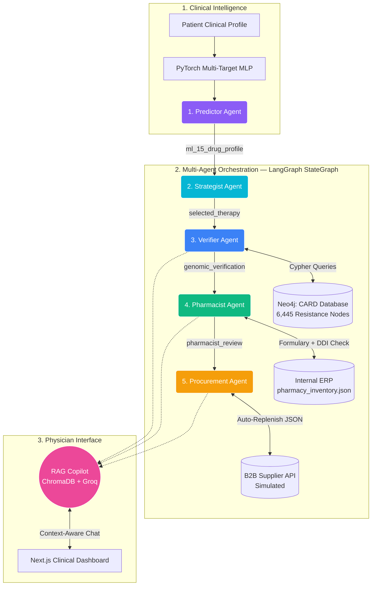

# 🧬 Sentinel-CDS
### Autonomous Clinical Decision Support via Multi-Agent Orchestration

> An end-to-end medical intelligence platform that predicts Antimicrobial Resistance (AMR), verifies predictions against genomic evidence, formulates risk-adjusted therapies, and autonomously manages hospital supply chains — all via a 5-agent LangGraph pipeline.

[](https://python.org)
[](https://fastapi.tiangolo.com)
[](https://langchain-ai.github.io/langgraph)
[](https://neo4j.com)
[](https://nextjs.org)
[](LICENSE)

---

## 🎯 Problem Statement

Antimicrobial Resistance (AMR) kills **1.27 million people annually** and is projected to cause **10 million deaths/year by 2050**. Current clinical workflows suffer from:

- **Delayed resistance detection** — lab cultures take 48-72 hours
- **Formulary blind spots** — physicians unaware of DDIs and stock levels
- **Supply chain gaps** — critical drugs run out with no automated restocking

Sentinel-CDS bridges all three gaps in a single autonomous pipeline.

---

## 🏗️ System Architecture



---

## 🚀 The 5-Agent Pipeline

Each agent is a LangGraph node — a Python function that reads from and writes to the shared `AgentState` TypedDict. No agent talks to another directly.

### 🧠 Node 1 — Predictor Agent
- Runs patient profile through **PyTorch multi-target MLP**
- Predicts resistance probability for **15 antibiotics simultaneously**
- Returns `ml_15_drug_profile`: `{drug: {is_resistant, confidence}}`
- MRSA demo override for guaranteed multi-drug resistant showcase

### ⚕️ Node 2 — Strategist Agent
- Pure constraint satisfaction — no LLM, no regex
- Drops all drugs where `is_resistant == True`
- Applies patient safety filters: Penicillin allergy, Renal impairment
- Selects drug with lowest resistance confidence score
- Escalates to ID Specialist if no safe options remain

### 🧬 Node 3 — Verifier Agent
- Queries **Neo4j CARD knowledge graph** for each flagged drug
- Maps drug abbreviations to biological drug classes via `DRUG_CLASS_MAP`
- Returns genomic evidence: gene name, family, resistance mechanism
- Falls back to general class mechanism if pathogen-specific match not found

### 💊 Node 4 — Pharmacist Agent
- Checks `pharmacy_inventory.json` for formulary status
- Flags Drug-Drug Interactions (DDIs)
- Returns cost per vial and approval requirements
- Skips gracefully if no drug selected (escalation path)

### 📦 Node 5 — Procurement Agent
- Checks current stock vs critical threshold (default: 10 vials)
- If critical: simulates async B2B supplier API call (`asyncio.sleep`)
- Generates structured Purchase Order JSON payload
- Never writes to local files — returns PO in state (production safe)

---

## 💬 RAG Copilot

A physician-facing chat interface grounded in **WHO AMR Clinical Guidelines**.

**Pipeline:**
```
Physician Query
      ↓
ChromaDB Semantic Search (HuggingFace all-MiniLM-L6-v2)
      ↓
Top-3 relevant WHO guideline chunks retrieved
      ↓
Groq LLaMA-3.3-70B generates grounded response
      ↓
Patient context (resistance profile, selected therapy) injected
```

**Physicians can ask:**
- "Why was Ciprofloxacin excluded for this patient?"
- "What are the resistance mechanisms for this strain?"
- "Are there alternatives given renal impairment?"

---

## 🛠️ Tech Stack

| Layer | Technologies |
|---|---|
| **ML** | PyTorch (Multi-Target MLP), Scikit-Learn (SMOTE), Pandas |
| **Agentic AI** | LangGraph (StateGraph), LangChain, Groq LLaMA-3.3-70B |
| **Knowledge Graph** | Neo4j AuraDB, Cypher, CARD Genomic Registry (6,445 nodes) |
| **RAG** | ChromaDB, HuggingFace all-MiniLM-L6-v2, WHO AMR Guidelines |
| **Backend** | FastAPI, Pydantic, Python 3.10+, asyncio |
| **Frontend** | Next.js 15, React 19, Tailwind CSS, Framer Motion, Recharts |

---

## 📁 Project Structure

```
Sentinel-CDS/
│
├── backend/
│   ├── app/
│   │   ├── agents/
│   │   │   ├── nodes/
│   │   │   │   ├── predictor.py      # Node 1: PyTorch MLP inference
│   │   │   │   ├── strategist.py     # Node 2: Constraint satisfaction
│   │   │   │   ├── verifier.py       # Node 3: Neo4j CARD queries
│   │   │   │   ├── pharmacist.py     # Node 4: Formulary + DDI check
│   │   │   │   └── procurement.py    # Node 5: B2B supply chain
│   │   │   ├── state.py              # AgentState TypedDict
│   │   │   └── workflow.py           # StateGraph wiring
│   │   ├── api/routes/analyze.py     # POST /api/analyze
│   │   ├── core/database.py          # Neo4j Singleton connection pool
│   │   ├── ml/mlp.py                 # SentinelMLP model + inference
│   │   ├── rag/
│   │   │   ├── ingest.py             # ChromaDB ingestion
│   │   │   └── copilot.py            # RAG retrieval + Groq response
│   │   └── schemas/analysis_types.py # Pydantic models + AgentState
│   ├── data/
│   │   ├── pharmacy_inventory.json   # Local ERP database
│   │   ├── location_stats.csv        # Antibiogram data
│   │   └── docs/amr_guidelines.txt  # WHO AMR guidelines (RAG source)
│   ├── scripts/
│   │   ├── ingest_card.py            # CARD → Neo4j loader
│   │   └── train.py                  # MLP training script
│   ├── main.py                       # FastAPI entry point
│   └── requirements.txt
│
├── frontend/
│   └── src/
│       ├── app/                      # Next.js App Router
│       ├── components/
│       │   ├── dashboard/            # PatientForm, DrugChart, AgentPipeline
│       │   └── chat/                 # Copilot chat interface
│       └── lib/api.ts                # FastAPI call wrappers
│
└── README.md
```

---

## ⚙️ Setup & Installation

### Prerequisites
- Python 3.10+
- Node.js 18+
- Neo4j AuraDB account (free tier)
- Groq API key (free tier)

### 1. Clone the repo
```bash
git clone https://github.com/apoorva-ppl/sentinel_CDS.git
cd sentinel_CDS
```

### 2. Backend setup
```bash
cd backend
python -m venv venv
source venv/bin/activate  # Windows: venv\Scripts\activate
pip install -r requirements.txt
```

### 3. Environment variables
```bash
cp .env.example .env
```
Fill in your `.env`:
```
NEO4J_URI=neo4j+s://xxxxxx.databases.neo4j.io
NEO4J_USERNAME=neo4j
NEO4J_PASSWORD=your_password
GROQ_API_KEY=your_groq_key
```

### 4. Load CARD knowledge graph into Neo4j
```bash
python scripts/ingest_card.py
# Ingests 6,445 resistance gene nodes
```

### 5. Build RAG vector store
```bash
python app/rag/ingest.py
# Chunks WHO AMR guidelines into ChromaDB
```

### 6. Run backend
```bash
uvicorn main:app --reload
# API running at http://localhost:8000
# Swagger docs at http://localhost:8000/docs
```

### 7. Frontend setup
```bash
cd ../frontend
npm install
npm run dev
# App running at http://localhost:3000
```

---

## 🔌 API Reference

### `POST /api/analyze`
Runs the full 5-agent pipeline.

**Request:**
```json
{
  "isolate_id": "Escherichia coli",
  "patient_profile": {
    "Age": 45,
    "Gender": 1,
    "Diabetes": false,
    "Hospital_before": true,
    "Hypertension": false,
    "Infection_Freq": 3,
    "Penicillin_Allergy": false,
    "Renal_Impaired": false
  }
}
```

**Response:**
```json
{
  "isolate_id": "Escherichia coli",
  "ml_15_drug_profile": {
    "CIP": {"is_resistant": true, "confidence": 0.91},
    "VAN": {"is_resistant": false, "confidence": 0.04}
  },
  "selected_therapy": "VAN",
  "genomic_verification": ["[CIP] Verified: CpxR (efflux pump)..."],
  "pharmacist_review": {"status": "Approved", "cost_usd": 45.0},
  "logistics_status": {"status": "STOCK_SUFFICIENT", "current_stock": 48},
  "trace": ["✓ ML Predictor: 8/15 drugs flagged resistant", "..."],
  "timestamp": "2026-07-10T00:00:00Z"
}
```

### `POST /api/chat`
Physician RAG Copilot.

**Request:**
```json
{
  "message": "Why was Ciprofloxacin excluded?",
  "context": { ...full analysis result... },
  "history": []
}
```

---

## 🎯 Key Engineering Decisions

**Why LangGraph over LangChain?**
LangChain's `SequentialChain` is stateless and linear. LangGraph gives us shared `TypedDict` state across all 5 nodes, `conditional_edges` for procurement routing, and production-grade graph execution. Our pipeline needs branching, not just chaining.

**Why Neo4j over a relational DB?**
Resistance relationships are inherently graph-structured: `Gene → CONFERS_RESISTANCE_TO → DrugClass`. A graph DB makes these traversals O(1) instead of expensive JOIN operations.

**Why no file writes in Procurement?**
Writing to local JSON files inside a FastAPI endpoint causes file lock crashes under concurrent requests. We return the PO payload in state and let the frontend render it — production safe.

**Why `asyncio.run()` instead of `async def` for Procurement node?**
LangGraph's StateGraph executor is synchronous. Making one node async breaks the graph runtime. We keep nodes sync and use `asyncio.run()` to call the async supplier API helper internally.

---

## 👥 The Team

Built by **The Found Tokens**

**Hridesh** — ML Engineering (PyTorch MLP, training pipeline, model artifacts)

**Apoorva** — Agentic Systems (LangGraph pipeline, Neo4j, RAG, FastAPI, Frontend)

---

## 📄 License

MIT License — see [LICENSE](LICENSE) for details.
